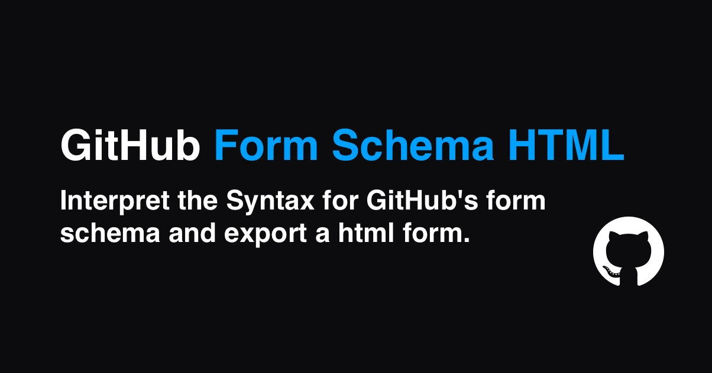

# GitHub Form Schema HTML

[![npm version][npm-version-src]][npm-version-href]
[![npm downloads][npm-downloads-src]][npm-downloads-href]
[![License][license-src]][license-href]

> GitHub Form Schema HTML for [GitHub's form schema](https://docs.github.com/en/communities/using-templates-to-encourage-useful-issues-and-pull-requests/syntax-for-githubs-form-schema)

- [✨ &nbsp;Release Notes](https://github.com/JonathanSchndr/github-form-schema-html/releases)
- [🔴 Demo](https://github.com/JonathanSchndr/github-form-schema-html/tree/main/example)

## Features

GitHub Form Schema HTML convert your GitHub Issue Template in a real HTML Form. [(Schema)](https://docs.github.com/en/communities/using-templates-to-encourage-useful-issues-and-pull-requests/syntax-for-githubs-form-schema)

- Supported Types:
  - Markdown
  - Textarea
  - Input
  - Dropdown
  - Checkboxes
- [Primer CSS](https://primer.style/) support
- TypeScript Support


## Setup

```sh
yarn add github-form-schema-html # yarn
npm i github-form-schema-html # npm
```

## Basic usage

```html
<form>
  <div id="load"></div>
  <button class="btn" type="submit">Submit</button>
</form>
```

```javascript
// basic
document.getElementById('load').innerHTML = new GitHubFormSchemaHtml({ yml: rawYml }).render();

// with fetch (optional, if yml content need loaded before)
import { GitHubFormSchemaHtml } from 'github-form-schema-html';
fetch('./form.yml').then(res => res.text()).then(rawYml => {
  document.getElementById('load').innerHTML = new GitHubFormSchemaHtml({ yml: rawYml }).render();
})
```

## Development

1. Clone this repository
2. Install dependencies using `yarn install` or `npm install`
3. Change vite.confg.js to `mode:'development'` / `minify:false` / `sourcemap:true`
4. Start development server using `yarn dev && yarn build:watch` or `npm run dev && npm run build:watch`

## License

Copyright (c) 2022 Jonathan Schneider
[MIT License](./LICENSE)

<!-- Badges -->

[npm-version-src]: https://img.shields.io/npm/v/github-form-schema-html/latest.svg
[npm-version-href]: https://npmjs.com/package/github-form-schema-html
[npm-downloads-src]: https://img.shields.io/npm/dt/github-form-schema-html.svg
[npm-downloads-href]: https://npmjs.com/package/github-form-schema-html
[license-src]: https://img.shields.io/npm/l/github-form-schema-html.svg
[license-href]: https://npmjs.com/package/github-form-schema-html
